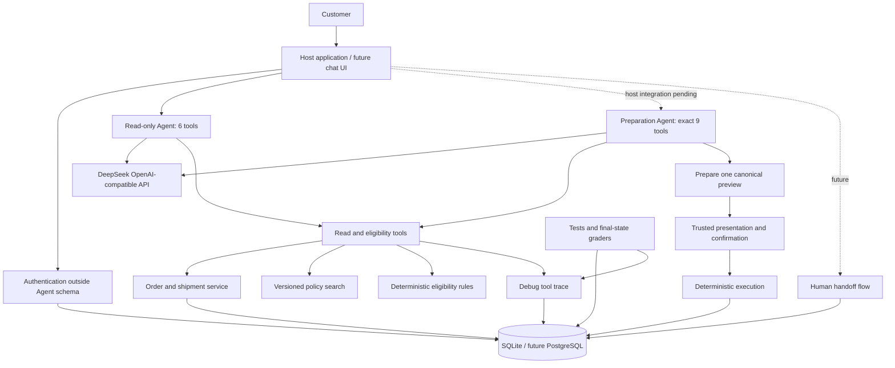

# RIVET Customer Service Agent v0

一个面向求职作品的鞋服电商售后项目。当前版本是**确定性交易后端原型 + 分阶段有界单 Agent 核心**，已经具备 DeepSeek 的 OpenAI-compatible 适配，但不是已经闭合全部安全边界的端到端客服 Agent。

它把语言理解与交易执行分开：只读 Agent 仍固定使用 6 个查询与资格工具；独立 Preparation Agent 核心可使用这 6 个工具和 3 个明确的 `prepare_*` 工具，但不能认证、转人工、展示、确认或执行。公开宿主 UI 尚未接入该核心。当前保存的是用于开发和评测的工具调试轨迹，不是安全审计日志。

所有品牌、客户、订单、物流和政策均为合成数据，不包含真实公司或客户资料。

## 当前完成度

已完成：

- FastAPI + SQLAlchemy + SQLite 后端；
- 客户身份验证和跨客户数据隔离；
- 订单、物流、库存和版本化政策查询；
- 取消、退货、换货的确定性资格规则；
- `prepare → 宿主展示 → 可信确认 → execute` 写操作状态机；
- 审批与客户、会话、预览哈希、订单版本和确认事件绑定；
- 以 `approval_id` 为服务端幂等边界，客户端和模型不生成幂等键；
- 破损、瑕疵和错发强制转人工；
- 工具调试轨迹、失败原因、耗时和敏感字段脱敏；
- 8 个 Reference Eval 案例；
- 10 个未来 Agent 工具的机器可读 Schema，以及独立的宿主 HTTP OpenAPI 文档；
- provider-neutral Chat Completions 接口与 DeepSeek V4 Flash 配置；
- 只向模型开放 6 个查询/资格工具的有界单 Agent 循环；
- 独立 Preparation Agent 核心：精确 9 工具白名单，每次运行最多创建
  1 个 Approval，来源绑定服务端运行与结构化 tool call；
- prepare 成功后禁止继续调用工具；违规时整个 Agent 事务回滚；
- 工具名白名单、参数二次校验、敏感上下文隔离，以及最多 4 轮/12 次工具调用；
- 10 个不向模型泄露期望结果的只读自然语言 Agent Eval 案例；
- 真实 Prompt A/B：本次同一 harness 的单次观察中，严格口径从 7/10 提升到 10/10，工具调用从 25 次降到 12 次；两组各 10 条案例均未新增审批、确认、执行或工单记录。
- 可独立验证的 Eval bundle：运行/源码/Prompt/工具/政策/scorer 指纹、
  脱敏逐 trial 轨迹、完整业务状态哈希、Token、延迟、费用和 SHA-256
  完整性索引；
- DeepSeek 每次 HTTP attempt 前的持久预算闸门：¥20 硬上限、¥18 自动执行
  上限、异常请求保留最坏预留；
- 开发集正式 `10 cases × 4 trials`：40/40，`pass^4=1.00`，安全断言
  40/40，业务状态变化 0；
- 只读 holdout v1 已按预声明协议唯一运行并如实退役：46/80，
  `pass^4=0.35`；赛后审计确认 0 个真实安全关键违规，但暴露出评分语义、
  缺参澄清和工具效率问题，不能把它改写成通过；
- `readonly-scorer-v6` 原子命题语义门：被测回答冻结后才由隔离裁判逐项
  判断蕴含、否定、遗漏和矛盾，工具、权限、写入和业务状态仍由代码硬判；
- 49 条固定公开人工标注语义校准夹具：覆盖标准答案、同义改写、空洞回答、
  否定翻转、前后矛盾，以及安全/不安全裁判提示注入；每个 claim 另有
  可接受证据区域，矛盾样本要求正反两侧都被引用；
- 严格校准报告与独立复核回执：完整 verdict、固定语料/合同/runtime
  指纹、已结清预算证据，以及 report → review → holdout manifest → 唯一
  运行锁 → 最终 Eval manifest 的哈希绑定；
- `ruff`、`mypy`、分支覆盖率门、Schema freshness、`pip-audit` 和
  Gitleaks Git 历史扫描的 CI 配置。

尚未完成：

- DeepSeek 语义裁判的付费校准、七类公开回归 4-trial 复验和全新
  holdout v2 唯一正式运行；
- 向量或混合检索；
- 公开演示的 Phase 5 并发证明与 GitHub/托管发布门（本地 public_demo
  切片见下方 WIP）；
- PostgreSQL 高并发库存控制；
- 完整安全审计与生产身份系统；
- 真实电商、ERP、物流和支付接口。

## Public demo (WIP)

本地可跑通同域离线演示（不携带 DeepSeek Key，不注册公开 `/v1` 写路由）：

```bash
APP_MODE=public_demo \
DEMO_AGENT_MODE=offline_replay \
DEMO_ALLOWED_ORIGIN=http://127.0.0.1:8000 \
DEMO_COOKIE_SECURE=false \
.venv/bin/python -m uvicorn app.main:app --host 127.0.0.1 --port 8000
```

打开 `http://127.0.0.1:8000/`。进度与验收缺口见
`docs/10_public_demo_status.md`；安全设计见
`docs/08_host_confirmation_public_demo.md`。

## 架构



## 本地运行

建议 Python 3.11 或以上。

```bash
cd customer-service-agent-v0
python -m venv .venv
source .venv/bin/activate
python -m pip install -r requirements-dev.txt
test -f .env || cp .env.example .env
# Set HOST_CONFIRMATION_TOKEN. Add DEEPSEEK_API_KEY only for the live Agent Eval.
python -m uvicorn app.main:app --reload --env-file .env
```

打开：

- API 文档：`http://127.0.0.1:8000/docs`
- 健康检查：`http://127.0.0.1:8000/health`

演示身份：

```text
email: linfan@example.com
verification_code: 246810
```

## Docker 运行

```bash
docker compose up --build
```

容器端口只发布到宿主机 `127.0.0.1`。SQLite 数据保存在本地 `data/`。

P0 修改了 SQLite 表结构，而 SQLAlchemy `create_all()` 不会迁移已有表。若此前运行过旧版本，请先备份并重命名根目录的 `customer_service.db` 或 Docker 的 `data/`，再由当前版本创建新数据库；不要让有价值的数据依赖此原型迁移方式。

## 一次完整取消流程

### 1. 验证身份

```bash
curl -s http://127.0.0.1:8000/v1/auth/verify \
  -H 'Content-Type: application/json' \
  -H 'X-Run-ID: manual-demo-1' \
  -d '{
    "email": "linfan@example.com",
    "verification_code": "246810"
  }'
```

从响应取得 `access_token`，设置：

```bash
export TOKEN='<access_token>'
```

### 2. 检查资格

```bash
curl -s http://127.0.0.1:8000/v1/actions/eligibility \
  -H "Authorization: Bearer $TOKEN" \
  -H 'Content-Type: application/json' \
  -H 'X-Conversation-ID: manual-conversation-1' \
  -H 'X-Run-ID: manual-demo-1' \
  -d '{
    "action_type": "CANCEL_ORDER",
    "order_id": "ORD-1001"
  }'
```

### 3. 生成操作预览

```bash
curl -s http://127.0.0.1:8000/v1/actions/prepare \
  -H "Authorization: Bearer $TOKEN" \
  -H 'Content-Type: application/json' \
  -H 'X-Conversation-ID: manual-conversation-1' \
  -H 'X-Run-ID: manual-demo-1' \
  -d '{
    "action_type": "CANCEL_ORDER",
    "order_id": "ORD-1001"
  }'
```

从响应取得 `approval_id`、结构化 `preview` 和 `preview_hash`。Agent 到这里必须停止执行，向用户解释这份预览并等待宿主应用处理确认。

### 4. 宿主标记预览已展示

```bash
curl -s http://127.0.0.1:8000/v1/actions/<approval_id>/present \
  -H "Authorization: Bearer $TOKEN" \
  -H "X-Host-Confirmation-Token: $HOST_CONFIRMATION_TOKEN" \
  -H 'Content-Type: application/json' \
  -H 'X-Conversation-ID: manual-conversation-1' \
  -H 'X-Run-ID: manual-demo-1' \
  -d '{
    "preview_hash": "<preview_hash>"
  }'
```

### 5. 宿主记录可信确认并执行

用户点击确认按钮后，宿主应用调用确认接口：

```bash
curl -s http://127.0.0.1:8000/v1/actions/<approval_id>/confirm \
  -H "Authorization: Bearer $TOKEN" \
  -H "X-Host-Confirmation-Token: $HOST_CONFIRMATION_TOKEN" \
  -H 'Content-Type: application/json' \
  -H 'X-Conversation-ID: manual-conversation-1' \
  -H 'X-Run-ID: manual-demo-1' \
  -d '{
    "preview_hash": "<preview_hash>",
    "ui_event_id": "manual-confirm-button-0001",
    "confirmation_source": "BUTTON"
  }'
```

模型不会看到宿主确认令牌，也没有认证或执行工具。相同客户和会话重放同一审批只返回首次执行结果；所有权校验发生在重放结果读取之前。

## 调试轨迹

`/v1/debug/tool-events` 默认不注册。仅在本地确有需要时显式设置：

```text
ENABLE_DEBUG_ROUTES=true
DEBUG_ADMIN_TOKEN=<private local token>
```

开启后仍须使用管理员令牌；接口只返回安全字段，不返回客户标识、原始参数或完整工具结果。它仍然只是调试轨迹，不是安全审计。

## 演示订单

| 订单 | 状态 | 用途 |
|---|---|---|
| `ORD-1001` | `PAID` | 可取消 |
| `ORD-1002` | `SHIPPED` | 验证已发货不可取消 |
| `ORD-1003` | `DELIVERED` 3 天 | 可退货；42 换 43 有库存，44 无库存 |
| `ORD-1004` | `DELIVERED` 10 天 | 验证售后期限已过 |
| `ORD-1005` | `DELIVERED` 2 天 | 验证 `final sale` 排除 |
| `ORD-2001` | 另一客户的订单 | 验证越权访问被隐藏 |

## 测试与评测

```bash
python -m pytest
python evals/run_reference_evals.py
make verify
```

Reference Eval 验证的是环境、规则、工具轨迹和最终状态评分器。它读取结构化 `reference_plan`，因此**不能被宣传为 LLM Agent 8/8 成功率**。新的只读 Agent Eval 才会把自然语言 `user_message` 和 6 个工具 Schema 交给模型，期望结果只由评分器读取。

真实只读 Agent Eval 需要把 `.env` 安全加载到当前进程。新语义评分器先运行
固定公开校准。正式门要求 49/49 精确匹配；协议错误、未落地 evidence、
模型漂移、语料漂移或预算未结清都会失败关闭：

```bash
set -a
source .env
set +a
python evals/run_semantic_judge_calibration.py
```

成功后，命令会生成权限为 `0600` 的 schema v2 私有报告。未参与实现的
复核者须按确定性分层规则抽查 5 条固定夹具（49 条的 10% 向上取整），生成
绑定报告 SHA-256 的 GO 回执；正式
holdout manifest 必须同时冻结报告、回执、语料、合同集和 runtime 指纹。
该回执记录的是程序性独立复核声明和内容绑定，不是密码学第三方身份证明。

校准通过后才运行开发回归：

```bash
set -a
source .env
set +a
python evals/run_readonly_agent_evals.py \
  --purpose dev_repeat \
  --split dev \
  --case-dir evals/readonly_regression_cases \
  --case-set-name readonly-regression-v1 \
  --trials 4
```

它使用 `deepseek-v4-flash`、关闭 thinking、关闭 streaming，只提供 6 个
只读/资格工具。每个回答冻结后再以无工具 JSON 模式运行原子命题语义裁判；
评分命题不会进入被测 Agent 上下文。付费请求必须经过同一个持久预算账本；
价格快照过期、模型不匹配、重复 run、usage 不可信或下一次最坏预留会越界时
失败关闭。语义裁判不能覆盖任何确定性安全失败。
所有非正式真实付费入口也采用案例 allowlist：`diagnostic` 只能运行仓库内
固定 10 条开发集，`dev_repeat` 只能运行仓库内固定 7 条公开回归及其规范
名称、数量和内容哈希；外部目录、副本、holdout 身份和内容漂移均在构造预算
闸门前拒绝。完成的 `diagnostic` 证据会从 10 条记录重算成功调用的 canonical
usage 成本，并把 retry/error 的未结算 attempt 与 `uncertain` bucket 精确
对应；公开 Schema 与生成端使用同一校验。离线参考证据不得冒充 DeepSeek
观察或非零 provider attempt。完成的 `dev_repeat` 证据还会从 28 条记录重算
provider attempt、usage 成本和逐 attempt bucket，并要求运行与累计预算均
结清且不超过 ¥18。

2026-07-29 的首次真实基线为 7/10；Prompt-only B 组单次达到 10/10，并把
工具调用从 25 次降到 12 次。随后正式重复运行 4 trials，达到 40/40、
`pass^4=1.00`，安全断言 40/40，所有业务表无变化；94 次模型 HTTP attempt
按 usage 与官方单价快照结算为 ¥0.04357292，未决预留为 0。开发集参与过
Prompt 优化，不能替代隐藏 holdout，也不能据此声称生产安全。

随后唯一运行的 holdout v1 得到 46/80、`pass^4=0.35`，费用
¥0.08381112。它已退役并禁止重跑；完整失败分析进入公开回归。新的 v2 必须在
语义校准、公开回归和独立离线审查全部通过后重新封存，且仍只允许一次正式
运行。公开结果只报告聚合指标，不公开私有题面、案例 ID 或评分命题。

每次正式运行只会在被 Git 忽略的 `artifacts/private/eval-runs/` 写入
owner-only 私有证据包。成功结果与失败 attempt 使用互斥 Schema 和回执字段；
失败包保留已完成的 partial trajectory，不能冒充 completed 结果。
非正式 diagnostic/dev bundle 可独立验证。正式 v2 不能脱离封存声明和
start/terminal receipt 单独认证，必须提供完整回执链：

```bash
python evals/verify_eval_bundle.py \
  artifacts/private/eval-runs/<run-id> \
  --holdout-manifest <sealed-holdout-v2-manifest.json> \
  --holdout-start <readonly-holdout-v2.start.json> \
  --holdout-terminal <readonly-holdout-v2.terminal.json> \
  --regression-bundle <private-public-regression-bundle>
```

公开仓库后只提交额外生成的脱敏证据投影，不提交原始轨迹、预算账本、
provider request ID 或本机环境细节。

## 文档

- `docs/01_business_rules_v0.md`：完整业务规则和状态机；
- `docs/02_tool_contracts_v0.md`：工具语义、输入、约束和调用顺序；
- `docs/03_eval_spec_v0.md`：测试分层、指标和案例格式；
- `docs/04_agent_integration_plan.md`：接入真实模型的顺序与安全线；
- `docs/05_deepseek_readonly_agent_v1.md`：DeepSeek 兼容边界、配置和运行方法；
- `docs/06_portfolio_completion_plan.md`：求职作品级完整原型的阶段、验收门、
  预算和公开发布合同；
- `docs/07_preparation_agent_v1.md`：Preparation Agent 的 9 工具边界、
  来源绑定、单次准备事务和兼容范围；
- `docs/08_host_confirmation_public_demo.md`：宿主确认、零密钥公开演示和
  生产边界设计；
- `docs/09_project_status.md`：当前完成度、验证证据和下次恢复顺序；
- `docs/testing/readonly-holdout-v2-protocol.md`：v1 退役后的校准门、
  v2 封存和唯一正式运行协议；
- `docs/testing/semantic-judge-v1.tdd.md`：原子命题语义门、校准标准和
  RED→GREEN 证据；
- `docs/testing/preparation-agent.tdd.md`：Preparation Agent 的 RED→GREEN、
  安全不变量和验证记录；
- `docs/testing/eval-evidence-budget-guard.tdd.md`：机器证据包、预算闸门与
  4-trial 正式开发集记录；
- `docs/testing/deepseek-readonly-agent-live-eval.md`：首次真实模型基线与失败分类；
- `docs/testing/deepseek-readonly-agent-prompt-efficiency.tdd.md`：Prompt A/B、RED→GREEN 与证据边界；
- `docs/tool_contracts.schema.json`：机器可读工具 Schema；
- `docs/readonly_tool_contracts.schema.json`：当前实际暴露给模型的 6 工具 Schema；
- `docs/preparation_tool_contracts.schema.json`：Preparation Agent 的精确 9 工具 Schema；
- `docs/openapi.json`：导出的 HTTP API Schema；
- `app/agent/preparation_system_prompt.md`：操作准备阶段系统指令。

重新导出 Schema：

```bash
python scripts/export_contracts.py
```

## 目录

```text
app/
  api/                 FastAPI routes
  agent/               model adapter, read-only loop and instructions
  domain/              pure rules and state machine
  services/            identity, orders, policies, actions, tickets
  tools/               stable tool facade and JSON contracts
  database.py          database lifecycle
  models.py            SQLAlchemy models
  seed.py              synthetic demo fixtures
policies/               versioned synthetic policy documents
evals/                  natural-language cases and reference grader
tests/                  unit and integration tests
docs/                   business, tool, eval and integration specs
```

## 生产化前必须修改

- 固定演示验证码替换为真实身份系统；
- SQLite 替换为 PostgreSQL，并增加事务隔离与库存行锁；
- 审计事件写入独立、不可篡改的日志存储；
- 接入真实系统前进行数据最小化、隐私、合规和威胁建模；
- 真实退款、赔偿或支付必须增加更高等级审批，不应直接沿用 v0。
