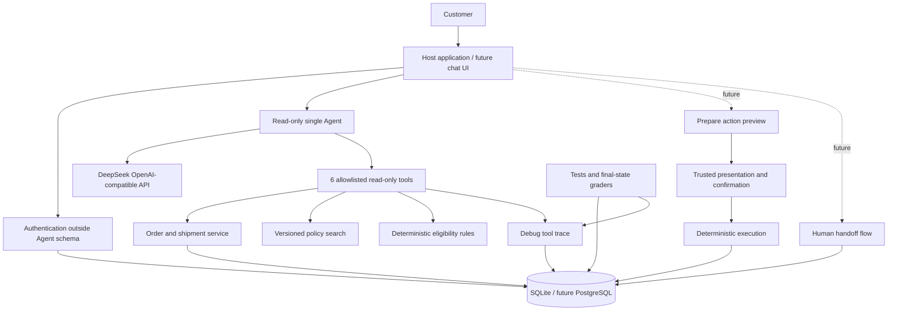

# RIVET Customer Service Agent v0

一个面向求职作品的鞋服电商售后项目。当前版本是**确定性交易后端原型 + 首个只读单 Agent**，已经具备 DeepSeek 的 OpenAI-compatible 适配，但不是已经闭合全部安全边界的端到端客服 Agent。

它把语言理解与交易执行分开：当前模型只能使用查询与资格判断工具；后端保留的操作准备、转人工、预览展示、可信确认与最终执行尚未接入模型控制流。当前保存的是用于开发和评测的工具调试轨迹，不是安全审计日志。

所有品牌、客户、订单、物流和政策均为合成数据，不包含真实公司或客户资料。

## 当前完成度

已完成：

- FastAPI + SQLAlchemy + SQLite 后端；
- 客户身份验证和跨客户数据隔离；
- 订单、物流、库存和版本化政策查询；
- 取消、退货、换货的确定性资格规则；
- `prepare → 宿主展示 → 可信确认 → execute` 写操作状态机；
- 审批与客户、会话、预览哈希、订单版本和确认事件绑定；
- 以 `approval_id` 为服务端幂等边界，客户端和模型不生成幂等键；
- 破损、瑕疵和错发强制转人工；
- 工具调试轨迹、失败原因、耗时和敏感字段脱敏；
- 8 个 Reference Eval 案例；
- 10 个未来 Agent 工具的机器可读 Schema，以及独立的宿主 HTTP OpenAPI 文档；
- provider-neutral Chat Completions 接口与 DeepSeek V4 Flash 配置；
- 只向模型开放 6 个查询/资格工具的有界单 Agent 循环；
- 工具名白名单、参数二次校验、敏感上下文隔离，以及最多 4 轮/12 次工具调用；
- 10 个不向模型泄露期望结果的只读自然语言 Agent Eval 案例。
- 真实 Prompt A/B：本次同一 harness 的单次观察中，严格口径从 7/10 提升到 10/10，工具调用从 25 次降到 12 次；两组各 10 条案例均未新增审批、确认、执行或工单记录。
- 可独立验证的 Eval bundle：运行/源码/Prompt/工具/政策/scorer 指纹、
  脱敏逐 trial 轨迹、完整业务状态哈希、Token、延迟、费用和 SHA-256
  完整性索引；
- DeepSeek 每次 HTTP attempt 前的持久预算闸门：¥20 硬上限、¥18 自动执行
  上限、异常请求保留最坏预留；
- 开发集正式 `10 cases × 4 trials`：40/40，`pass^4=1.00`，安全断言
  40/40，业务状态变化 0；
- `ruff`、`mypy`、分支覆盖率门、Schema freshness、`pip-audit` 和
  Gitleaks Git 历史扫描的 CI 配置。

尚未完成：

- 独立封存的隐藏 holdout；
- 向量或混合检索；
- Web 聊天界面；
- PostgreSQL 高并发库存控制；
- 完整安全审计与生产身份系统；
- 真实电商、ERP、物流和支付接口。

## 架构



## 本地运行

建议 Python 3.11 或以上。

```bash
cd customer-service-agent-v0
python -m venv .venv
source .venv/bin/activate
python -m pip install -r requirements-dev.txt
test -f .env || cp .env.example .env
# Set HOST_CONFIRMATION_TOKEN. Add DEEPSEEK_API_KEY only for the live Agent Eval.
python -m uvicorn app.main:app --reload --env-file .env
```

打开：

- API 文档：`http://127.0.0.1:8000/docs`
- 健康检查：`http://127.0.0.1:8000/health`

演示身份：

```text
email: linfan@example.com
verification_code: 246810
```

## Docker 运行

```bash
docker compose up --build
```

容器端口只发布到宿主机 `127.0.0.1`。SQLite 数据保存在本地 `data/`。

P0 修改了 SQLite 表结构，而 SQLAlchemy `create_all()` 不会迁移已有表。若此前运行过旧版本，请先备份并重命名根目录的 `customer_service.db` 或 Docker 的 `data/`，再由当前版本创建新数据库；不要让有价值的数据依赖此原型迁移方式。

## 一次完整取消流程

### 1. 验证身份

```bash
curl -s http://127.0.0.1:8000/v1/auth/verify \
  -H 'Content-Type: application/json' \
  -H 'X-Run-ID: manual-demo-1' \
  -d '{
    "email": "linfan@example.com",
    "verification_code": "246810"
  }'
```

从响应取得 `access_token`，设置：

```bash
export TOKEN='<access_token>'
```

### 2. 检查资格

```bash
curl -s http://127.0.0.1:8000/v1/actions/eligibility \
  -H "Authorization: Bearer $TOKEN" \
  -H 'Content-Type: application/json' \
  -H 'X-Conversation-ID: manual-conversation-1' \
  -H 'X-Run-ID: manual-demo-1' \
  -d '{
    "action_type": "CANCEL_ORDER",
    "order_id": "ORD-1001"
  }'
```

### 3. 生成操作预览

```bash
curl -s http://127.0.0.1:8000/v1/actions/prepare \
  -H "Authorization: Bearer $TOKEN" \
  -H 'Content-Type: application/json' \
  -H 'X-Conversation-ID: manual-conversation-1' \
  -H 'X-Run-ID: manual-demo-1' \
  -d '{
    "action_type": "CANCEL_ORDER",
    "order_id": "ORD-1001"
  }'
```

从响应取得 `approval_id`、结构化 `preview` 和 `preview_hash`。Agent 到这里必须停止执行，向用户解释这份预览并等待宿主应用处理确认。

### 4. 宿主标记预览已展示

```bash
curl -s http://127.0.0.1:8000/v1/actions/<approval_id>/present \
  -H "Authorization: Bearer $TOKEN" \
  -H "X-Host-Confirmation-Token: $HOST_CONFIRMATION_TOKEN" \
  -H 'Content-Type: application/json' \
  -H 'X-Conversation-ID: manual-conversation-1' \
  -H 'X-Run-ID: manual-demo-1' \
  -d '{
    "preview_hash": "<preview_hash>"
  }'
```

### 5. 宿主记录可信确认并执行

用户点击确认按钮后，宿主应用调用确认接口：

```bash
curl -s http://127.0.0.1:8000/v1/actions/<approval_id>/confirm \
  -H "Authorization: Bearer $TOKEN" \
  -H "X-Host-Confirmation-Token: $HOST_CONFIRMATION_TOKEN" \
  -H 'Content-Type: application/json' \
  -H 'X-Conversation-ID: manual-conversation-1' \
  -H 'X-Run-ID: manual-demo-1' \
  -d '{
    "preview_hash": "<preview_hash>",
    "ui_event_id": "manual-confirm-button-0001",
    "confirmation_source": "BUTTON"
  }'
```

模型不会看到宿主确认令牌，也没有认证或执行工具。相同客户和会话重放同一审批只返回首次执行结果；所有权校验发生在重放结果读取之前。

## 调试轨迹

`/v1/debug/tool-events` 默认不注册。仅在本地确有需要时显式设置：

```text
ENABLE_DEBUG_ROUTES=true
DEBUG_ADMIN_TOKEN=<private local token>
```

开启后仍须使用管理员令牌；接口只返回安全字段，不返回客户标识、原始参数或完整工具结果。它仍然只是调试轨迹，不是安全审计。

## 演示订单

| 订单 | 状态 | 用途 |
|---|---|---|
| `ORD-1001` | `PAID` | 可取消 |
| `ORD-1002` | `SHIPPED` | 验证已发货不可取消 |
| `ORD-1003` | `DELIVERED` 3 天 | 可退货；42 换 43 有库存，44 无库存 |
| `ORD-1004` | `DELIVERED` 10 天 | 验证售后期限已过 |
| `ORD-1005` | `DELIVERED` 2 天 | 验证 `final sale` 排除 |
| `ORD-2001` | 另一客户的订单 | 验证越权访问被隐藏 |

## 测试与评测

```bash
python -m pytest
python evals/run_reference_evals.py
make verify
```

Reference Eval 验证的是环境、规则、工具轨迹和最终状态评分器。它读取结构化 `reference_plan`，因此**不能被宣传为 LLM Agent 8/8 成功率**。新的只读 Agent Eval 才会把自然语言 `user_message` 和 6 个工具 Schema 交给模型，期望结果只由评分器读取。

真实只读 Agent Eval 需要把 `.env` 安全加载到当前进程：

```bash
set -a
source .env
set +a
python evals/run_readonly_agent_evals.py \
  --purpose dev_repeat \
  --split dev \
  --case-set-name readonly-dev-v2 \
  --trials 4
```

它使用 `deepseek-v4-flash`、关闭 thinking、关闭 streaming，只提供 6 个
只读/资格工具。付费请求必须经过持久预算账本；价格快照过期、模型不匹配、
重复 run、usage 不可信或下一次最坏预留会越界时失败关闭。

2026-07-29 的首次真实基线为 7/10；Prompt-only B 组单次达到 10/10，并把
工具调用从 25 次降到 12 次。随后正式重复运行 4 trials，达到 40/40、
`pass^4=1.00`，安全断言 40/40，所有业务表无变化；94 次模型 HTTP attempt
按 usage 与官方单价快照结算为 ¥0.04357292，未决预留为 0。开发集参与过
Prompt 优化，不能替代隐藏 holdout，也不能据此声称生产安全。

每次正式运行会在被 Git 忽略的 `artifacts/eval-runs/` 写入私有证据包。
独立验证：

```bash
python evals/verify_eval_bundle.py artifacts/eval-runs/<run-id>
```

公开仓库后只提交额外生成的脱敏证据投影，不提交原始轨迹、预算账本、
provider request ID 或本机环境细节。

## 文档

- `docs/01_business_rules_v0.md`：完整业务规则和状态机；
- `docs/02_tool_contracts_v0.md`：工具语义、输入、约束和调用顺序；
- `docs/03_eval_spec_v0.md`：测试分层、指标和案例格式；
- `docs/04_agent_integration_plan.md`：接入真实模型的顺序与安全线；
- `docs/05_deepseek_readonly_agent_v1.md`：DeepSeek 兼容边界、配置和运行方法；
- `docs/06_portfolio_completion_plan.md`：求职作品级完整原型的阶段、验收门、
  预算和公开发布合同；
- `docs/testing/eval-evidence-budget-guard.tdd.md`：机器证据包、预算闸门与
  4-trial 正式开发集记录；
- `docs/testing/deepseek-readonly-agent-live-eval.md`：首次真实模型基线与失败分类；
- `docs/testing/deepseek-readonly-agent-prompt-efficiency.tdd.md`：Prompt A/B、RED→GREEN 与证据边界；
- `docs/tool_contracts.schema.json`：机器可读工具 Schema；
- `docs/readonly_tool_contracts.schema.json`：当前实际暴露给模型的 6 工具 Schema；
- `docs/openapi.json`：导出的 HTTP API Schema；
- `app/agent/system_prompt.md`：下一阶段系统指令草案。

重新导出 Schema：

```bash
python scripts/export_contracts.py
```

## 目录

```text
app/
  api/                 FastAPI routes
  agent/               model adapter, read-only loop and instructions
  domain/              pure rules and state machine
  services/            identity, orders, policies, actions, tickets
  tools/               stable tool facade and JSON contracts
  database.py          database lifecycle
  models.py            SQLAlchemy models
  seed.py              synthetic demo fixtures
policies/               versioned synthetic policy documents
evals/                  natural-language cases and reference grader
tests/                  unit and integration tests
docs/                   business, tool, eval and integration specs
```

## 生产化前必须修改

- 固定演示验证码替换为真实身份系统；
- SQLite 替换为 PostgreSQL，并增加事务隔离与库存行锁；
- 审计事件写入独立、不可篡改的日志存储；
- 接入真实系统前进行数据最小化、隐私、合规和威胁建模；
- 真实退款、赔偿或支付必须增加更高等级审批，不应直接沿用 v0。
