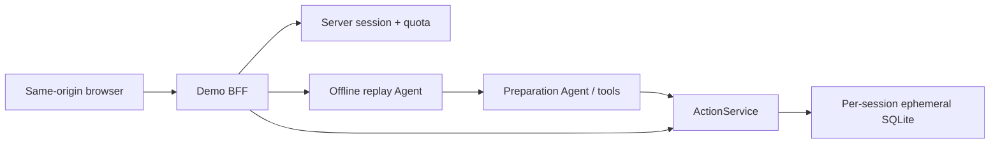

# 宿主确认与公开演示安全设计

## 1. 读者与范围

本文面向项目实现者、代码评审者和面试官，定义 Phase 4–6 的宿主确认与公开
演示边界。目标是在浏览器中演示完整的：

```text
离线对话 → 真实 prepare → canonical confirmation card
→ 结构化按钮确认 → 确定性 execute → reset
```

公开演示不部署 DeepSeek API Key，不把浏览器视为可信宿主，也不宣称达到商业
生产身份、隐私、审计或高可用标准。

## 2. 威胁模型

公开访问者可能：

- 修改任意请求体、Cookie、Header 和前端代码；
- 重放、并发或跨会话提交确认；
- 伪造模型消息、工具结果、预览、确认和执行成功；
- 输入提示注入、超长内容或真实个人信息；
- 尝试读取其他访客的状态或耗尽公开资源。

因此以下值只能存在于服务端：

```text
customer_id
access_token
conversation_id
server_run_id
approval_id
preview_hash
ui_event_id
confirmation_source
HOST_CONFIRMATION_TOKEN
任何执行幂等键
```

浏览器收到的是规范化显示数据和不透明会话状态，不获得生成执行权限所需的
内部标识。

## 3. 拓扑与模式



公开模式固定：

```text
APP_MODE=public_demo
DEMO_AGENT_MODE=offline_replay
provider HTTP calls=0
single process / single worker
```

`public_demo` 启动时若发现在线模型模式或 DeepSeek Key，应失败关闭或明确忽略
该 Key，绝不能静默回退到付费模型。

## 4. 浏览器 BFF 契约

公开路由：

```text
POST /demo/session
POST /demo/messages
GET  /demo/pending-action
POST /demo/pending-action/presented
POST /demo/pending-action/confirm
POST /demo/reset
GET  /health
```

`presented` 和 `confirm` 的请求体为空。浏览器提交任何内部字段都因
`extra="forbid"` 返回 422。

浏览器会话 Cookie：

```text
__Host-rivet_demo=<opaque random token>
HttpOnly; Secure; SameSite=Strict; Path=/
```

改变状态的请求还必须通过：

- 精确配置的同源 `Origin`；
- 会话绑定 CSRF token；
- `application/json`；
- 请求体大小与每会话额度。

不启用 wildcard CORS，也不盲目信任 `X-Forwarded-For`。

公开模式不注册通用身份、工单、直接 prepare/present/confirm/execute 或调试
路由。现有 `/v1` 接口只用于本地可信集成模式。

## 5. 服务端会话

每个浏览器会话保存：

```text
cookie_token_hash
csrf_token_hash
customer_id
auth_token
conversation_id
server_run_id
pending_approval_id
pending_ui_event_id
message / prepare / execute counters
expires_at
isolated runtime
```

推荐默认值：

- 128 位以上随机 Cookie 与 CSRF；
- 会话 TTL 30 分钟；
- 最多 25–50 个活动会话；
- 每会话 30 条消息、3 次 prepare、3 次 confirm/execute；
- 用户消息最多 500 字；
- 超限返回 429 并带 `Retry-After`。

每个会话使用独立内存 SQLite、Tools、合成客户认证和 seed。`reset` 销毁旧
engine/runtime，旋转 Cookie 并重新 seed，避免不同访客共享交易状态。

## 6. Canonical confirmation card

确认卡不能使用模型自由文本或模型返回的自造 JSON。可信链路是：

```text
Preparation Agent 调用独立 prepare_* 工具
→ Approval 持久化
→ BFF 按 customer + conversation + server_run_id 读取唯一 active Approval
→ 服务端重新计算并验证 preview_hash
→ 严格类型的浏览器安全投影
→ 前端按 action_type 穷举渲染
```

以下情况全部失败关闭：

- 找不到或找到多份当前审批；
- 审批已过期、被取代、拒绝或终止；
- preview hash 不一致；
- action/schema 版本未知；
- Approval 来源不是当前服务端运行；
- 模型文本与数据库 preview 不一致。

前端必须完整展示操作类型、订单、商品、数量/尺码、退款或库存影响、到期时间
以及“尚未执行”。前端使用 `textContent`，不使用 `innerHTML` 渲染输入。

## 7. 展示、确认与执行

`POST /presented` 只表示可信宿主已展示数据库中的 canonical preview。BFF
从会话读取 approval 和 hash 后调用服务层。

`POST /confirm` 固定使用服务端保存的：

```text
approval_id
preview_hash
ui_event_id
confirmation_source=BUTTON
customer_id
conversation_id
```

`ui_event_id` 在 pending action 建立时生成一次并保存。浏览器重试继续使用
同一值，不允许浏览器选择另一个事件。

执行事务内必须重新检查：

- 客户与会话归属；
- Approval 来源、状态、到期时间和 preview 完整性；
- 匹配且未消费的按钮确认；
- 订单版本与当前确定性资格；
- 退换货冲突和换货库存。

## 8. 幂等、并发与故障

SQLite 不提供可依赖的 `SELECT ... FOR UPDATE` 行锁。执行入口需要原子认领：

```sql
UPDATE approvals
SET status = 'EXECUTING'
WHERE id = :id
  AND customer_id = :customer_id
  AND conversation_id = :conversation_id
  AND status = 'CONFIRMED'
```

- `rowcount == 1`：当前事务获得执行权；
- 已存在 `ActionExecution`：返回同一结果并标记 replay；
- 正在执行：返回可重试状态；
- 终止状态：返回稳定的 409；
- 认领、业务写、execution record、消费确认和 `EXECUTED` 必须同事务提交。

Return/Exchange 业务表应以唯一 `approval_id` 作为第二道 exactly-once 约束。
换货库存使用条件原子更新并检查 rowcount，库存不得为负。

必须覆盖的故障点：

1. 确认提交后、执行开始前中断；
2. 业务写入前异常；
3. 业务 flush 后、事务提交前异常；
4. 事务提交后、响应返回前断连；
5. SQLite busy/locked；
6. stale order version；
7. 执行时库存被其他审批抢空。

基础设施 5xx 不应把 Approval 永久置为失败；确定性的 stale/out-of-stock
等业务冲突可以终止审批并消费确认。

## 9. 公开演示隐私与滥用边界

- 页面明确只允许虚构演示数据；
- 不持久化原始用户消息，不接分析 SDK；
- ToolEvent 不记录公开自由文本或长期保留的完整结果；
- 明显邮箱、手机号和卡号可被启发式阻断，但不能宣称完整 PII 检测；
- public replay 的 `user_note` 固定为空；
- 未匹配的输入只返回支持场景，不回退到在线模型；
- 调试路由始终关闭；
- 响应设置 CSP、`frame-ancestors 'none'`、`nosniff` 和 Referrer-Policy。

## 10. TDD 与验收门

### 权限与预览

- 模型伪造 preview，UI 仍只显示数据库版本；
- 篡改数据库 preview 后不能展示或确认；
- 浏览器提交 hash、event、token、customer 或 conversation 时 422；
- 未展示、过期、被取代、跨客户和跨会话均无业务写；
- 未知 action/schema fail closed。

### 会话与秘密

- HTML、JS、JSON、OpenAPI 和浏览器网络请求中没有服务端令牌；
- B 会话不能读取或确认 A 会话审批；
- Origin/CSRF 缺失或错误时 403；
- Cookie 属性完整；
- public 模式不存在直接 `/v1` 写路由和 debug 路由。

### 幂等与并发

- 三类 action 顺序重放 10 次只产生一次业务效果；
- 同一确认 20–50 路并发，只允许一次执行或返回可恢复状态；
- 一个 UI event 不能确认两个审批；
- 同一商品的竞争审批最多一个成功；
- 换货库存只减一次且永不为负；
- 跨客户重放保持统一未找到，不泄露历史结果。

### 故障与公开模式

- 每个故障点均证明完整回滚或安全恢复；
- 响应丢失后返回同一 execution；
- 任意公开输入、未知输入和重试的 provider 请求均为 0；
- reset 恢复 seed 并旋转会话；
- TTL、活动会话上限、速率、额度和请求体限制生效；
- 浏览器端到端演示完整流程；
- 构建产物、镜像层、运行环境、响应和部署日志无 Key。

只有完整离线验证、并发/故障测试、真实浏览器网络检查和部署后检查均通过，
这一阶段才算完成。
