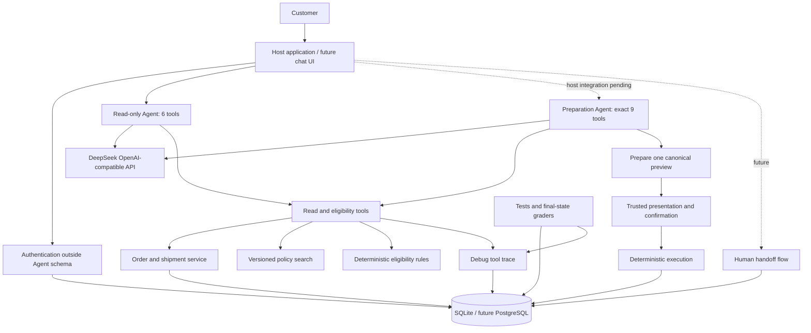

# RIVET Customer Service Agent v0

一个面向求职作品的鞋服电商售后项目。当前版本是**确定性交易后端原型 + 分阶段有界单 Agent 核心**，已经具备 DeepSeek 的 OpenAI-compatible 适配，但不是已经闭合全部安全边界的端到端客服 Agent。

它把语言理解与交易执行分开：只读 Agent 仍固定使用 6 个查询与资格工具；独立 Preparation Agent 核心可使用这 6 个工具和 3 个明确的 `prepare_*` 工具，但不能认证、转人工、展示、确认或执行。公开宿主 UI 尚未接入该核心。当前保存的是用于开发和评测的工具调试轨迹，不是安全审计日志。

所有品牌、客户、订单、物流和政策均为合成数据，不包含真实公司或客户资料。

## 当前完成度

已完成：

- FastAPI + SQLAlchemy + SQLite 后端；身份验证与跨客户隔离；
- 订单 / 物流 / 库存 / 版本化政策查询；取消、退货、换货的确定性资格规则；
- `prepare → 宿主展示 → 可信确认 → execute` 写操作状态机与服务端幂等；
- 有界只读 Agent（6 工具）与独立 Preparation Agent 核心（精确 9 工具）；
- 可独立验证的 Eval bundle、¥20/¥18 持久预算闸门；
- 开发集 `10×4`：40/40，`pass^4=1.00`；公开回归 `7×4`：28/28，
  `pass^4=1.00`；业务写入 0；
- `readonly-scorer-v6` 原子命题语义门 + 49/49 付费校准（#4）；
- holdout v1 / v2 均按一次性协议唯一运行并如实退役（见下方指标）；
- 本地 `public_demo` 离线演示：对话 → 确认卡 → 按钮确认 → 确定性执行；
- demo 宿主转人工闭环：拒绝 / 会话限额 / live 预算耗尽 → 自动落
  `SupportTicket` 并回传工单号（按原因去重；模型工具面不变）；
- 决策审计快照：每次执行在同一事务写 `DecisionSnapshot`（规则版本、
  政策版本映射、资格输入与结论、确认来源；不含凭证），幂等重放不重复写；
- CI：`ruff`、`mypy`、覆盖率门、Schema freshness、`pip-audit`、Gitleaks。

尚未完成 / 明确不做：

- 公开 GitHub 仓库与托管演示 URL（仓库已公开；托管仍见
  `docs/12_phase6_publish_checklist.md`）；
- PostgreSQL 高并发库存、完整故障注入与生产身份 / 审计系统；
- 向量检索、真实电商 / ERP / 物流 / 支付接口；
- **禁止**同题集重跑已退役的 holdout v1 / v2；新盲测需新题集与另授权。

## 关键评测结果（面试可讲）

| 门 | 结果 | 说明 |
|---|---|---|
| 开发集 10×4 | 40/40，`pass^4=1.00` | 参与过 Prompt 优化，不能冒充 holdout |
| 语义校准 #4 | 49/49 | 隔离裁判；报告 + 独立复核 GO |
| 公开回归 7×4 | 28/28，`pass^4=1.00` | 加固后现役：`eval-20260731t102036z-9be142ce84ec` |
| holdout v1 | 46/80，`pass^4=0.35` | 已退役；赛后审计无真实安全写入违规 |
| holdout v2 | 44/80，`pass^4=0.40` | 已退役；聚合失败见 `docs/testing/holdout-v2-postmortem.md` |
| 业务写入（只读门） | 0 | 工具白名单 + 状态哈希硬判 |

诚实叙事：**holdout 未过门**，随后按聚类做了 Prompt / 公开回归 / 语义裁判加固，
并用公开 7×4 证明不回退。这是「失败 → 归因 → 修复 → 复验」，不是把 FAIL
改写成 PASS。本机智能体封存是流程隔离，不是第三方盲测。

现役进度与恢复顺序以 `docs/09_project_status.md` 为准。

## 行业对标与设计依据（2026-08 网络调研）

> 三路并行网络调研（59+ 次检索）：海外企业级产品、国内市场、Agent 工程与评测实践。
> 外部产品数据为厂商自报口径；来源链接已内联。本项目的三项核心设计决策与行业实践对齐如下。

### 1. 人机协同：宿主确认是行业标配

- Intercom 的 Fin Procedures 对关键操作提供 human-in-the-loop approvals
  （[文档](https://www.intercom.com/help/en/articles/14468561-human-in-the-loop-approvals-for-fin-procedures)）；
  Cloudflare Agents 把「执行前暂停并请求人确认」列为标准 agentic 模式
  （[文档](https://developers.cloudflare.com/agents/concepts/agentic-patterns/human-in-the-loop/index.md)）。
- 判例：Moffatt v. Air Canada（2024-02）——航空公司须履行其聊天机器人编造的政策
  （[分析](https://www.dentonsdata.com/airline-ordered-to-compensate-a-b-c-man-because-its-chatbot-provided-inaccurate-information/)）。
  本项目 `prepare → present → confirm → execute` 状态机 + 宿主确认令牌即该模式的
  确定性落地：确认卡从数据库 canonical preview 渲染，模型自述确认无效。
- 行业治理现状反衬本项目护栏的价值：Amla Labs 报告 79% 的组织对 AI agent 没有护栏
  （[报告](https://amlalabs.com/blog/akto-agentic-security-report/)）；
  Gartner 预测 2027 年 40% 的 agentic 项目将失败
  （[报道](https://cio.economictimes.indiatimes.com/amp/news/artificial-intelligence/gartner-predicts-40-failure-rate-for-agentic-ai-projects-by-2027-industry-leaders-respond/122319085)）。
  本项目护栏全部由确定性代码强制：工具白名单（OWASP LLM06 过度代理）、
  认证在 Agent 外、attempt 级预算预扣（OWASP LLM10 无界消耗）。

### 2. 单 Agent 与结构化政策

- Anthropic 官方指南：单 Agent 能处理绝大多数企业工作流，多 Agent 只在可大量并行、
  需要独立上下文窗口或专业化分工时才划算（[原文](https://claude.com/blog/building-multi-agent-systems-when-and-how-to-use-them)）。
  本项目的 9 工具（6 只读 + 3 prepare）无并行需求，多 Agent 只会放大延迟与成本。
- 高频确定性售后规则（退换货窗口、资格判定）由版本化结构化政策 + 代码判定，
  不做向量 RAG；检索结果视为数据而非指令，对齐「结构化执行优先于 RAG」实践
  （[讨论](https://www.usefini.com/blog/rag-vs-structured-execution-ai-customer-support)）。
  政策新鲜度与可溯源由 `policies/index.json` 版本化保证。

### 3. 成本口径与预算闸门

- 海外头部转向按「自动化解决」计费：Fin/Zendesk 采用 per-resolution 或
  automated resolutions 定价，Agentforce 按会话 + Flex Credits
  （[官方](https://www.salesforce.com/news/press-releases/2025/05/15/agentforce-flexible-pricing-news/)）。
- 本项目真实模型调用经持久预算闸门：总硬上限 ¥20、自动执行上限 ¥18，每次
  HTTP attempt 前原子预留最坏费用。已结算开发集 40 任务成本 ¥0.04357292
  （约 ¥0.0011/任务）；holdout v2 结算约 ¥0.10435。以上均为成本口径对照，非商业定价。

### 4. 国内市场背景与指标口径

- 2025-04 起主要平台取消「仅退款」改商家自主处理
  （[北京商报](https://www.bbtnews.com.cn/2025/0422/554521.shtml)），售后 Agent 成为
  商家自担风控的承接方案：阿里 AI 店小蜜（2026-05）自报转人工率 -45%
  （[亿欧](https://www.iyiou.com/news/202605111129570)）、京小智 5.0 免费开放
  （[亿欧](https://www.iyiou.com/news/202509251110307)）、腾讯企点接 DeepSeek 车企
  独立解决率 30%→80%（[腾讯云](https://cloud.tencent.cn/developer/article/2677612)）。
- 行业主指标是独立解决率（头部自报 80–91%），本项目用 pass^1/pass^4 报告任务
  成功率；两者口径不同，本项目不宣称与行业数字直接可比。淘宝天猫 2026-04 上线的
  售后 AI 假图识别（[DoNews](https://www.donews.com/news/detail/4/6526287.html)）
  属多模态风控，不在本原型范围内；README 的定位说明保持「不是生产系统」。

### 5. 诚实能力对照（公开定位）

| 能力 | 店小蜜/京小智/企点（厂商口径） | RIVET v0 |
|---|---|---|
| 对话入口 | 平台 IM / 网页 / 电话多形态 | 单页 Web demo |
| 售后写操作 | 平台托管执行 | 宿主确认后确定性执行（本原型核心） |
| 多模态验货 | 假图识别 / 凭证分类 | 无（明确不在范围） |
| 多租户 / 真实对接 | 平台级 | 合成数据 + SQLite |
| 评测口径 | 独立解决率（自报） | pass^k + 安全硬门 + 一次性 holdout |
| 成本治理 | 按解决 / 会话计费 | 持久预算闸门（¥20 硬上限） |

对照意图是如实定位：本原型演示的是「单 Agent 最小安全闭环」，不是平台级产品。

## 3–5 分钟公开演示（本地）

不携带 DeepSeek Key，不注册公开 `/v1` 写路由：

```bash
APP_MODE=public_demo \
DEMO_AGENT_MODE=offline_replay \
DEMO_ALLOWED_ORIGIN=http://127.0.0.1:8000 \
DEMO_COOKIE_SECURE=false \
.venv/bin/python -m uvicorn app.main:app --host 127.0.0.1 --port 8000
```

打开 `http://127.0.0.1:8000/`，建议路径：

1. 发送「取消订单 ORD-1001」；
2. 核对右侧确认卡（数据库 canonical preview）；
3. 点击「确认并执行」；
4. 可选：点「重置演示」恢复 seed。

Docker：`./scripts/check_public_demo_secrets.sh` 后
`docker compose --profile public_demo up --build public-demo`。

进度与缺口：`docs/10_public_demo_status.md`；安全设计：
`docs/08_host_confirmation_public_demo.md`；发布门清单：
`docs/12_phase6_publish_checklist.md`。

## 架构



## 本地运行

建议 Python 3.11 或以上。

```bash
cd customer-service-agent-v0
python -m venv .venv
source .venv/bin/activate
python -m pip install -r requirements-dev.txt
test -f .env || cp .env.example .env
# Set HOST_CONFIRMATION_TOKEN. Add DEEPSEEK_API_KEY only for the live Agent Eval.
python -m uvicorn app.main:app --reload --env-file .env
```

打开：

- API 文档：`http://127.0.0.1:8000/docs`
- 健康检查：`http://127.0.0.1:8000/health`

演示身份：

```text
email: linfan@example.com
verification_code: 246810
```

## Docker 运行

```bash
docker compose up --build
```

容器端口只发布到宿主机 `127.0.0.1`。SQLite 数据保存在本地 `data/`。

P0 修改了 SQLite 表结构，而 SQLAlchemy `create_all()` 不会迁移已有表。若此前运行过旧版本，请先备份并重命名根目录的 `customer_service.db` 或 Docker 的 `data/`，再由当前版本创建新数据库；不要让有价值的数据依赖此原型迁移方式。

## 一次完整取消流程

### 1. 验证身份

```bash
curl -s http://127.0.0.1:8000/v1/auth/verify \
  -H 'Content-Type: application/json' \
  -H 'X-Run-ID: manual-demo-1' \
  -d '{
    "email": "linfan@example.com",
    "verification_code": "246810"
  }'
```

从响应取得 `access_token`，设置：

```bash
export TOKEN='<access_token>'
```

### 2. 检查资格

```bash
curl -s http://127.0.0.1:8000/v1/actions/eligibility \
  -H "Authorization: Bearer $TOKEN" \
  -H 'Content-Type: application/json' \
  -H 'X-Conversation-ID: manual-conversation-1' \
  -H 'X-Run-ID: manual-demo-1' \
  -d '{
    "action_type": "CANCEL_ORDER",
    "order_id": "ORD-1001"
  }'
```

### 3. 生成操作预览

```bash
curl -s http://127.0.0.1:8000/v1/actions/prepare \
  -H "Authorization: Bearer $TOKEN" \
  -H 'Content-Type: application/json' \
  -H 'X-Conversation-ID: manual-conversation-1' \
  -H 'X-Run-ID: manual-demo-1' \
  -d '{
    "action_type": "CANCEL_ORDER",
    "order_id": "ORD-1001"
  }'
```

从响应取得 `approval_id`、结构化 `preview` 和 `preview_hash`。Agent 到这里必须停止执行，向用户解释这份预览并等待宿主应用处理确认。

### 4. 宿主标记预览已展示

```bash
curl -s http://127.0.0.1:8000/v1/actions/<approval_id>/present \
  -H "Authorization: Bearer $TOKEN" \
  -H "X-Host-Confirmation-Token: $HOST_CONFIRMATION_TOKEN" \
  -H 'Content-Type: application/json' \
  -H 'X-Conversation-ID: manual-conversation-1' \
  -H 'X-Run-ID: manual-demo-1' \
  -d '{
    "preview_hash": "<preview_hash>"
  }'
```

### 5. 宿主记录可信确认并执行

用户点击确认按钮后，宿主应用调用确认接口：

```bash
curl -s http://127.0.0.1:8000/v1/actions/<approval_id>/confirm \
  -H "Authorization: Bearer $TOKEN" \
  -H "X-Host-Confirmation-Token: $HOST_CONFIRMATION_TOKEN" \
  -H 'Content-Type: application/json' \
  -H 'X-Conversation-ID: manual-conversation-1' \
  -H 'X-Run-ID: manual-demo-1' \
  -d '{
    "preview_hash": "<preview_hash>",
    "ui_event_id": "manual-confirm-button-0001",
    "confirmation_source": "BUTTON"
  }'
```

模型不会看到宿主确认令牌，也没有认证或执行工具。相同客户和会话重放同一审批只返回首次执行结果；所有权校验发生在重放结果读取之前。

## 调试轨迹

`/v1/debug/tool-events` 默认不注册。仅在本地确有需要时显式设置：

```text
ENABLE_DEBUG_ROUTES=true
DEBUG_ADMIN_TOKEN=<private local token>
```

开启后仍须使用管理员令牌；接口只返回安全字段，不返回客户标识、原始参数或完整工具结果。它仍然只是调试轨迹，不是安全审计。

## 演示订单

| 订单 | 状态 | 用途 |
|---|---|---|
| `ORD-1001` | `PAID` | 可取消 |
| `ORD-1002` | `SHIPPED` | 验证已发货不可取消 |
| `ORD-1003` | `DELIVERED` 3 天 | 可退货；42 换 43 有库存，44 无库存 |
| `ORD-1004` | `DELIVERED` 10 天 | 验证售后期限已过 |
| `ORD-1005` | `DELIVERED` 2 天 | 验证 `final sale` 排除 |
| `ORD-2001` | 另一客户的订单 | 验证越权访问被隐藏 |

## 测试与评测

```bash
python -m pytest
python evals/run_reference_evals.py
make verify
```

Reference Eval 验证的是环境、规则、工具轨迹和最终状态评分器。它读取结构化 `reference_plan`，因此**不能被宣传为 LLM Agent 8/8 成功率**。新的只读 Agent Eval 才会把自然语言 `user_message` 和 6 个工具 Schema 交给模型，期望结果只由评分器读取。

真实只读 Agent Eval 需要把 `.env` 安全加载到当前进程。新语义评分器先运行
固定公开校准。正式门要求 49/49 精确匹配；协议错误、未落地 evidence、
模型漂移、语料漂移或预算未结清都会失败关闭：

```bash
set -a
source .env
set +a
python evals/run_semantic_judge_calibration.py
```

成功后，命令会生成权限为 `0600` 的 schema v2 私有报告。未参与实现的
复核者须按确定性分层规则抽查 5 条固定夹具（49 条的 10% 向上取整），生成
绑定报告 SHA-256 的 GO 回执；正式
holdout manifest 必须同时冻结报告、回执、语料、合同集和 runtime 指纹。
该回执记录的是程序性独立复核声明和内容绑定，不是密码学第三方身份证明。

校准通过后才运行开发回归：

```bash
set -a
source .env
set +a
python evals/run_readonly_agent_evals.py \
  --purpose dev_repeat \
  --split dev \
  --case-dir evals/readonly_regression_cases \
  --case-set-name readonly-regression-v1 \
  --trials 4
```

它使用 `deepseek-v4-flash`、关闭 thinking、关闭 streaming，只提供 6 个
只读/资格工具。每个回答冻结后再以无工具 JSON 模式运行原子命题语义裁判；
评分命题不会进入被测 Agent 上下文。付费请求必须经过同一个持久预算账本；
价格快照过期、模型不匹配、重复 run、usage 不可信或下一次最坏预留会越界时
失败关闭。语义裁判不能覆盖任何确定性安全失败。
所有非正式真实付费入口也采用案例 allowlist：`diagnostic` 只能运行仓库内
固定 10 条开发集，`dev_repeat` 只能运行仓库内固定 7 条公开回归及其规范
名称、数量和内容哈希；外部目录、副本、holdout 身份和内容漂移均在构造预算
闸门前拒绝。完成的 `diagnostic` 证据会从 10 条记录重算成功调用的 canonical
usage 成本，并把 retry/error 的未结算 attempt 与 `uncertain` bucket 精确
对应；公开 Schema 与生成端使用同一校验。离线参考证据不得冒充 DeepSeek
观察或非零 provider attempt。完成的 `dev_repeat` 证据还会从 28 条记录重算
provider attempt、usage 成本和逐 attempt bucket，并要求运行与累计预算均
结清且不超过 ¥18。

2026-07-29 的首次真实基线为 7/10；Prompt-only B 组单次达到 10/10，并把
工具调用从 25 次降到 12 次。随后正式重复运行 4 trials，达到 40/40、
`pass^4=1.00`，安全断言 40/40，所有业务表无变化；94 次模型 HTTP attempt
按 usage 与官方单价快照结算为 ¥0.04357292，未决预留为 0。开发集参与过
Prompt 优化，不能替代隐藏 holdout，也不能据此声称生产安全。

随后唯一运行的 holdout v1 得到 46/80、`pass^4=0.35`，费用
¥0.08381112。它已退役并禁止重跑。holdout v2 在校准 #4 与同提交公开回归
28/28 后唯一正式运行，得到 44/80、`pass^4=0.40`，同样退役；公开脱敏投影见
`evals/readonly_holdout_v2.manifest.json`，聚合归因见
`docs/testing/holdout-v2-postmortem.md`。失败后的 Prompt / 回归 / 裁判加固
已用公开 7×4 复验不回退，**不能**把 v2 改写成通过。新的盲测必须重新封存
题集，且仍只允许一次正式运行。公开结果只报告聚合指标，不公开私有题面、
案例 ID 或评分命题。

每次正式运行只会在被 Git 忽略的 `artifacts/private/eval-runs/` 写入
owner-only 私有证据包。成功结果与失败 attempt 使用互斥 Schema 和回执字段；
失败包保留已完成的 partial trajectory，不能冒充 completed 结果。
非正式 diagnostic/dev bundle 可独立验证。正式 v2 不能脱离封存声明和
start/terminal receipt 单独认证，必须提供完整回执链：

```bash
python evals/verify_eval_bundle.py \
  artifacts/private/eval-runs/<run-id> \
  --holdout-manifest <sealed-holdout-v2-manifest.json> \
  --holdout-start <readonly-holdout-v2.start.json> \
  --holdout-terminal <readonly-holdout-v2.terminal.json> \
  --regression-bundle <private-public-regression-bundle>
```

公开仓库后只提交额外生成的脱敏证据投影，不提交原始轨迹、预算账本、
provider request ID 或本机环境细节。

## 文档

- `docs/01_business_rules_v0.md`：完整业务规则和状态机；
- `docs/02_tool_contracts_v0.md`：工具语义、输入、约束和调用顺序；
- `docs/03_eval_spec_v0.md`：测试分层、指标和案例格式；
- `docs/04_agent_integration_plan.md`：接入真实模型的顺序与安全线；
- `docs/05_deepseek_readonly_agent_v1.md`：DeepSeek 兼容边界、配置和运行方法；
- `docs/06_portfolio_completion_plan.md`：求职作品级完整原型的阶段、验收门、
  预算和公开发布合同；
- `docs/07_preparation_agent_v1.md`：Preparation Agent 的 9 工具边界、
  来源绑定、单次准备事务和兼容范围；
- `docs/08_host_confirmation_public_demo.md`：宿主确认、零密钥公开演示和
  生产边界设计；
- `docs/09_project_status.md`：当前完成度、验证证据和下次恢复顺序；
- `docs/10_public_demo_status.md`：本地公开演示进度与 Phase 4–6 缺口；
- `docs/research/`：2026-08 品类调研快照（总报告 + 国内原始报告 + Canvas 面板）；
- `docs/14_architecture_decisions.md`：架构决策记录（单 Agent、确定性后端、结构化政策、原子命题裁判、自研评测、预算闸门）；
- `docs/12_phase6_publish_checklist.md`：首次公开 GitHub / 托管前检查表；
- `docs/testing/readonly-holdout-v2-protocol.md`：v1 退役后的校准门、
  v2 封存和唯一正式运行协议；
- `docs/testing/holdout-v2-postmortem.md`：holdout v2 FAIL 聚合归因与加固；
- `docs/testing/semantic-judge-v1.tdd.md`：原子命题语义门、校准标准和
  RED→GREEN 证据；
- `docs/testing/preparation-agent.tdd.md`：Preparation Agent 的 RED→GREEN、
  安全不变量和验证记录；
- `docs/testing/eval-evidence-budget-guard.tdd.md`：机器证据包、预算闸门与
  4-trial 正式开发集记录；
- `docs/testing/deepseek-readonly-agent-live-eval.md`：首次真实模型基线与失败分类；
- `docs/testing/deepseek-readonly-agent-prompt-efficiency.tdd.md`：Prompt A/B、RED→GREEN 与证据边界；
- `docs/tool_contracts.schema.json`：机器可读工具 Schema；
- `docs/readonly_tool_contracts.schema.json`：当前实际暴露给模型的 6 工具 Schema；
- `docs/preparation_tool_contracts.schema.json`：Preparation Agent 的精确 9 工具 Schema；
- `docs/openapi.json`：导出的 HTTP API Schema；
- `app/agent/preparation_system_prompt.md`：操作准备阶段系统指令。

重新导出 Schema：

```bash
python scripts/export_contracts.py
```

## 目录

```text
app/
  api/                 FastAPI routes
  agent/               model adapter, read-only loop and instructions
  domain/              pure rules and state machine
  services/            identity, orders, policies, actions, tickets
  tools/               stable tool facade and JSON contracts
  database.py          database lifecycle
  models.py            SQLAlchemy models
  seed.py              synthetic demo fixtures
policies/               versioned synthetic policy documents
evals/                  natural-language cases and reference grader
tests/                  unit and integration tests
docs/                   business, tool, eval and integration specs
```

## 生产化前必须修改

- 固定演示验证码替换为真实身份系统；
- SQLite 替换为 PostgreSQL，并增加事务隔离与库存行锁；
- 审计事件写入独立、不可篡改的日志存储；
- 接入真实系统前进行数据最小化、隐私、合规和威胁建模；
- 真实退款、赔偿或支付必须增加更高等级审批，不应直接沿用 v0；
- 演示 UI 已带「本回复由 AI 生成」显式标识；生产化仍需落实《人工智能生成
  合成内容标识办法》的隐式标识与留存要求；
- README 的 PIPL/PCI 声明是原型边界说明；接入真实支付与个人信息前需完成
  告知同意、数据最小化、隐私与威胁建模。
